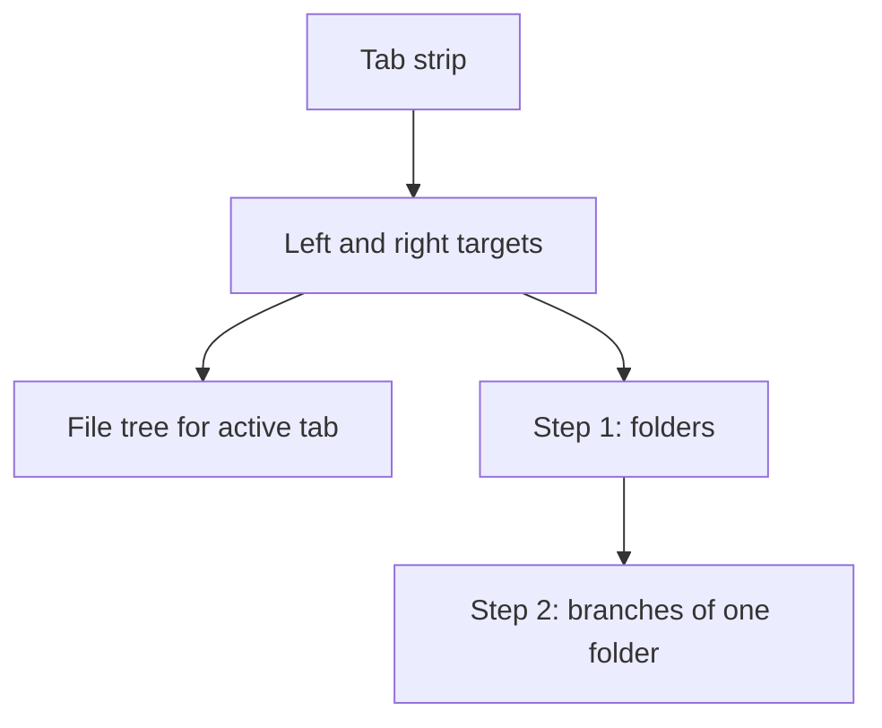
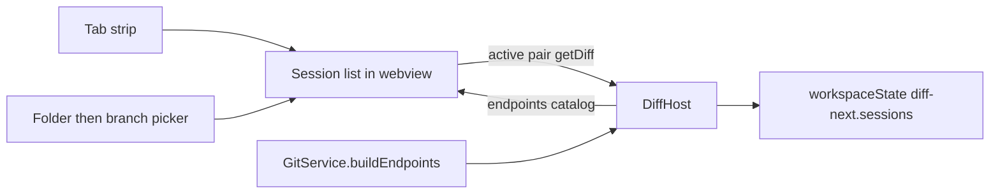

# Session Tabs and Folder-First Picker - Plan

## Goal Capsule

- **Objective:** Let a developer keep several compares open as sidebar tabs, and pick each side by folder then branch instead of scanning one flat list of every folder×ref.
- **Product authority:** This plan owns session tabs and the folder-first endpoint picker in the vscode-diff Next sidebar. Editor-area multi-panel and editor-diff session sync are not active scope.
- **Stop conditions:** Stop if the work would add remotes, sync VS Code editor diffs to tabs, or change file-status / discard / worktree-compare rules.
- **Execution profile:** Code change in the existing webview + DiffHost. Prove helpers with smoke tests, then manual sidebar smoke in a multi-root workspace.
- **Open blockers:** None.

---

## Product Contract

### Summary

The sidebar gains a tab strip so each tab holds one compare pair.
Each target control opens a two-step picker: choose a workspace folder, then a local branch of that folder.

### Problem Frame

The sidebar holds one compare.
Switching repos overwrites the pair, the file tree, and the selection.
The target controls are native OS dropdowns of every `{folder} · {ref}`.
In a multi-root workspace with many folders, finding the right repo is a hunt through a short clipped list.

### Key Decisions

- KD1. **Sidebar session tabs.** (session-settled: user-approved — chosen over editor-area panels or recents-only: tabs must hold live compares in the sidebar the user already uses.) Governs R1, R2, R3, R4, R12.
- KD2. **Folder then branch.** (session-settled: user-directed — chosen over a two-pane flyout and an accordion: many folders need a short folder list before any branch list.) Governs R5, R6, R7, R9, R10.
- KD3. **Reopen lands on the current folder's branches.** (session-settled: user-approved — chosen over always restarting at folders: everyday branch switches stay one step.) Governs R8.
- KD4. **A new tab starts unset.** Empty pickers, same as today's first-open empty state. Governs R3, R13.
- KD5. **Compare-view toggles are independent.** (session-settled: user-directed — chosen over a single all-on toolbar: each control is on or off by itself, labeled under the targets.) Governs R15, R16, R17.

### Requirements

**Sessions**

- R1. The sidebar can hold multiple compare sessions at once, each shown as a tab.
- R2. A tab is one compare pair plus that session's file tree, selection, folds, and commit-history UI state.
- R3. The user can add a tab, switch tabs, and close a tab. Closing is refused when only one tab remains.
- R4. Open sessions and the active tab survive webview reload and window reload for the same workspace.
- R12. The tab label is the folder name when both sides share a folder, otherwise both folder names.
- R13. A newly added tab starts with no endpoints selected.

**Picker**

- R5. Each target control (left and right) opens a custom picker, not a native OS select popup.
- R6. Step 1 lists workspace folders only, with type-to-filter on folder name.
- R7. Choosing a folder moves to step 2, which lists only that folder's local branches, with type-to-filter on branch name. HEAD is marked.
- R8. Reopening a side that already has a folder starts at step 2 for that folder, with a back action to step 1.
- R9. The two sides cannot be the same endpoint. The peer endpoint is excluded or disabled.
- R10. The closed control still shows `{folder} · {ref}` for the current side.
- R14. Choosing a branch closes the picker so the file list is visible. Clicking the file list also closes it.

**Compare view**

- R15. A labeled Compare view row sits under the two targets, not in the file-list header.
- R16. Wrap, ignore spaces, two columns, fold same, pin tab, and moved code are each an independent on/off toggle. Turning one on does not turn the others on.
- R17. Defaults: wrap on, two columns on, everything else off.
- R18. Prev file / Next file walk the current compare's changed files.

**Unchanged compare behavior**

- R11. File-tree, diffs, discard, worktree compare, and same-repo commit history behave as today once a pair is selected.

### Key Flows

- F1. Hold a second compare
  - **Trigger:** User has one compare open and needs another repo pair.
  - **Steps:** Add a tab. Pick folder then branch on each side. The first tab keeps its pair and tree.
  - **Outcome:** Two live sessions. Switching tabs restores each tree and selection.
  - **Covered by:** R1, R2, R3, R13

- F2. Pick a side in a crowded workspace
  - **Trigger:** User clicks the left or right target.
  - **Steps:** Folder list opens, or the branch list if that side already has a folder. User filters, picks a folder if needed, picks a branch.
  - **Outcome:** That side updates. The other side and other tabs are unchanged.
  - **Covered by:** R5, R6, R7, R8, R9

- F3. Change only the branch
  - **Trigger:** User reopens a side that already has a folder.
  - **Steps:** Branch list for that folder opens. User picks another branch, or goes back and picks another folder.
  - **Outcome:** Everyday branch switches stay one step.
  - **Covered by:** R8

### Acceptance Examples

- AE1. Two live compares
  - **Covers R1, R2, R3.**
  - **Given:** Tab A compares pth-main/main vs pth-1.2.0/1.2.0-PR with a file selected.
  - **When:** The user adds tab B, sets pdf-next/main vs pdf-next/release, then clicks tab A.
  - **Then:** Tab A still shows the original pair, tree, and selected file.

- AE2. Folder list is not a flat mash
  - **Covers R6, R7.**
  - **Given:** The workspace has many folders, each with several local branches.
  - **When:** The user opens a side with no folder yet.
  - **Then:** The list shows folders only. After choosing one folder, only that folder's branches appear.

- AE3. Reopen stays on the folder
  - **Covers R8.**
  - **Given:** Left is vscode-pdf-next · main.
  - **When:** The user opens the left picker.
  - **Then:** They see vscode-pdf-next's branches, with a back action to the folder list.

- AE4. Last tab cannot close
  - **Covers R3.**
  - **Given:** One tab remains.
  - **When:** The user tries to close it.
  - **Then:** The tab stays. The compare is not discarded.

- AE5. Sessions restore
  - **Covers R4.**
  - **Given:** Three tabs are open, the middle one active.
  - **When:** The sidebar webview is recreated in the same workspace.
  - **Then:** All three pairs return and the middle tab is active.

### Scope Boundaries

- No two-pane flyout picker and no accordion-of-all-folders picker.
- Switching tabs does not close, move, or restore VS Code editor diffs already opened from a session.
- The editor-area Compare Branches command stays a singleton panel.
- Remotes stay hidden. Endpoint identity stays local `{folder} · {ref}`.
- This work does not change file-status, discard, worktree compare, or commit-history rules.

### Dependencies / Assumptions

- Workspace folders already map to git roots via the existing endpoint builder.
- Native OS select cannot show a long, structured list. The picker must be custom.

### Sources / Research

- One pair of native selects: `src/webview/index.html`, `src/webview/main.js`, `src/webview/styles.css`.
- One last pair stored as `diff-next.lastTargets` in `src/host/DiffHost.ts`.
- Endpoints already carry `folder` and `ref` separately in `src/services/gitService.ts`.
- Editor panel is a singleton: `src/panels/BranchDiffPanel.ts`.
- Legacy `repos` / `branches` webview messages are no-ops. `getRepos` already aliases `getEndpoints`.

---

## Planning Contract

Product Contract preservation: changed Outstanding Questions — resolved into KTD1 and KTD5. No requirement or scope change.

### Key Technical Decisions

- KTD1. **Sessions persist in `workspaceState` as `diff-next.sessions`.** Array of `{ id, root1, ref1, root2, ref2 }` plus `activeId`. On first read, migrate `diff-next.lastTargets` into one session and leave the old key until the new key writes successfully. The webview no longer treats a single `id1`/`id2` as the only pair.
- KTD2. **Group the existing endpoint catalog in the webview.** `CompareEndpoint` already has `folder`, `root`, `ref`, `isHead`. No new git RPCs. Folder list is unique folders from `state.endpoints`. Branch list is endpoints of the chosen folder. Cite R6, R7.
- KTD3. **Host `lastTargets` is the active session only.** Autorefresh and `watchRepositories` follow the visible tab. Switching tabs posts that pair's `getDiff` / `getCommitHistory`. Inactive sessions keep their last tree in webview state and are not watched.
- KTD4. **`sendEndpoints` posts the catalog, not a chosen pair.** Today's `postEndpoints` overwrites `id1`/`id2` and would stomp every tab. After this work, a full or partial scan updates `endpoints` only. Pair selection is owned by the active session. First-ever workspace (no saved sessions) still starts with one empty tab per R13, not a host-picked default pair.
- KTD5. **Picker dismiss and keys.** Escape or click-outside closes the picker. Arrow keys move the visible list. Enter selects. Typing goes to the filter field. Same for folder step and branch step.
- KTD6. **Shared webview HTML.** Sidebar and the singleton editor panel both get tabs and the new picker. Do not fork the panel HTML. Still one editor panel, per Scope Boundaries.
- KTD7. **Extract picker/session helpers into TypeScript, inject into the webview.** Same pattern as `src/services/fileStatus.ts`. Smoke tests the compiled module, not a second copy in `main.js`.

### High-Level Technical Design

`applyEndpoints` today writes `id1`/`id2` from the host and calls `loadDiff`.
That path must become "merge catalog; do not change the active session pair unless the session is still unset and the user just picked."

### Assumptions

- No `docs/solutions/` learnings exist for this repo.
- A multi-root workspace can expose many folders. The picker must stay usable at tens of folders, not hundreds of folder×branch rows.

### Sequencing

U1 helpers and smoke, then U2 picker on the single current session, then U3 tabs and persist, then U4 docs.

---

## Implementation Units

### U1. Folder grouping helpers and smoke

- **Goal:** Endpoints can be clustered by folder, filtered, labeled, and peer-excluded without any UI.
- **Requirements:** R6, R7, R9, R12
- **Dependencies:** None
- **Files:** `src/services/endpointPicker.ts` (create), `scripts/smoke-picker.js` (create), `package.json`, `docs/DEVELOP.md`
- **Approach:**
  1. Add helpers: unique folders from endpoints, branches for one folder, filter by substring (case-insensitive), tab label per R12, exclude or flag the peer endpoint.
  2. Inject a small script snippet into the webview the way `statusTableScript` does, so `main.js` does not grow a second copy.
  3. Wire `npm run smoke:picker` into `npm run smoke`.
- **Patterns to follow:** `src/services/fileStatus.ts` and `scripts/smoke-status.js`
- **Test scenarios:**
  - Two folders with two branches each produce two folder rows, not four mixed rows. Covers AE2.
  - Filter `pdf` keeps `pdf-next` and drops `pth-main`.
  - Branches for folder A never include folder B's refs. HEAD is marked.
  - Peer id is absent from the other side's branch list. Covers R9.
  - Same-folder pair labels as one name. Cross-folder pair labels as both names. Covers R12.
  - Injected script is the only copy of the helper names in `src/webview/main.js` (same assertion idea as the status vocabulary smoke).
- **Verification:** `npm run compile` then `npm run smoke:picker` passes.

### U2. Folder-then-branch picker

- **Goal:** Each target control opens a custom two-step picker instead of a native select.
- **Requirements:** R5, R6, R7, R8, R9, R10, R13
- **Dependencies:** U1
- **Files:** `src/webview/index.html`, `src/webview/main.js`, `src/webview/styles.css`
- **Approach:**
  1. Replace `#endpoint1` / `#endpoint2` `<select>` with a closed button showing `{folder} · {ref}` per R10, or an empty prompt when unset.
  2. Open a panel that fills most of the sidebar. Step 1 is folders. Step 2 is that folder's branches. Back control on step 2.
  3. Reopen with a folder already set starts at step 2 per R8.
  4. Dismiss and keyboard per KTD5.
  5. Keep using existing `getEndpoints` / `endpoints` messages. Do not revive `getRepos` as a separate protocol.
- **Patterns to follow:** Commit search in `src/webview/main.js`. Target bar layout in `src/webview/styles.css`.
- **Execution note:** Prove U1 smoke first. Then swap the native selects.
- **Test scenarios:**
  - Opening an unset side lists folders only. Covers AE2 / F2.
  - Choosing a folder then a branch updates only that side's closed label. Covers R10.
  - Reopening that side shows that folder's branches and a back action. Covers AE3 / F3.
  - Escape and click-outside close the panel without changing the pair.
  - The two sides cannot resolve to the same endpoint id. Covers R9.
- **Verification:** Manual: open the sidebar, click left, confirm a long folder list, pick a folder, pick a branch. Repeat for a side that already has a folder.

### U3. Session tabs and persist

- **Goal:** Several compares stay alive as tabs and restore in the same workspace.
- **Requirements:** R1, R2, R3, R4, R11, R12, R13
- **Dependencies:** U2
- **Files:** `src/host/DiffHost.ts`, `src/webview/index.html`, `src/webview/main.js`, `src/webview/styles.css`, `scripts/smoke-picker.js`
- **Approach:**
  1. Webview state holds `sessions[]` and `activeId`. Each session stores the pair plus tree, selection, folds, commits, and commit-search text per R2.
  2. Tab strip above the target bar: label per R12, close, add. Horizontal scroll if tabs overflow. Last tab cannot close per R3 / AE4.
  3. Add tab creates an unset session per R13 / KD4.
  4. Switch tab renders that session's tree without refetching other tabs. Post `getDiff` for the active pair so host watchers follow KTD3.
  5. Persist per KTD1. `sendEndpoints` follows KTD4 — catalog only.
  6. Font size stays global, not per tab.
  7. Do not close or restore editor diffs when switching tabs.
- **Patterns to follow:** `SavedTargets` / `STATE_KEY` in `src/host/DiffHost.ts`. Webview `saveState` / `getState` in `src/webview/main.js`.
- **Test scenarios:**
  - Migrating `diff-next.lastTargets` yields one session. Missing new key does not drop the last pair.
  - Two sessions: switch back restores pair, selected path, and folds. Covers AE1 / F1.
  - Close is a no-op on the last tab. Covers AE4.
  - After a simulated restore payload, three sessions return with the saved `activeId`. Covers AE5.
  - `sendEndpoints` with a new catalog does not rewrite an already-set active pair. Covers KTD4.
  - Compare, discard, and commit history on the active tab still match current behavior. Covers R11.
- **Verification:** Manual: two workspace repos, two tabs, reload the window, confirm both tabs and the active one return. Autorefresh still updates the visible tab after a file save.

### U4. Usage and develop docs

- **Goal:** README and DEVELOP describe tabs and folder-then-branch pick, not dual native dropdowns.
- **Requirements:** R1, R5, R6, R7
- **Dependencies:** U3
- **Files:** `README.md`, `docs/DEVELOP.md`
- **Approach:** Update the Getting started / Usage steps and the Endpoints section in DEVELOP. Keep the 0.3.0 identity rules (one root per folder, local refs only). Mention `smoke:picker`.
- **Test expectation:** none -- documentation only
- **Verification:** The usage steps no longer say to pick from a single `{folder} · {ref}` dropdown.

---

## Verification Contract

| Gate | Command / action | Applies to |
|---|---|---|
| Compile | `npm run compile` | U1–U3 |
| Lint | `npm run lint` | U1–U3 |
| Existing smoke | `npm run smoke:paths` and `npm run smoke:status` | must stay green |
| New smoke | `npm run smoke:picker` | U1, U3 migrate/label cases |
| Full smoke | `npm run smoke` | before considering the work done |
| Manual sidebar | Multi-root workspace: add tab, switch, close last (refused), folder-then-branch on each side, reload window | U2, U3, AE1–AE5 |

---

## Definition of Done

- Every R1–R13 behavior is implemented or explicitly still out of scope (none of these R-IDs are out of scope).
- U1–U3 test scenarios have a home in `scripts/smoke-picker.js` or a recorded manual check in DEVELOP.
- `npm run compile`, `npm run lint`, and `npm run smoke` pass.
- Abandoned experimental picker or tab code is removed.
- README Usage and DEVELOP Endpoints no longer describe native dual dropdowns as the way to pick a side.
